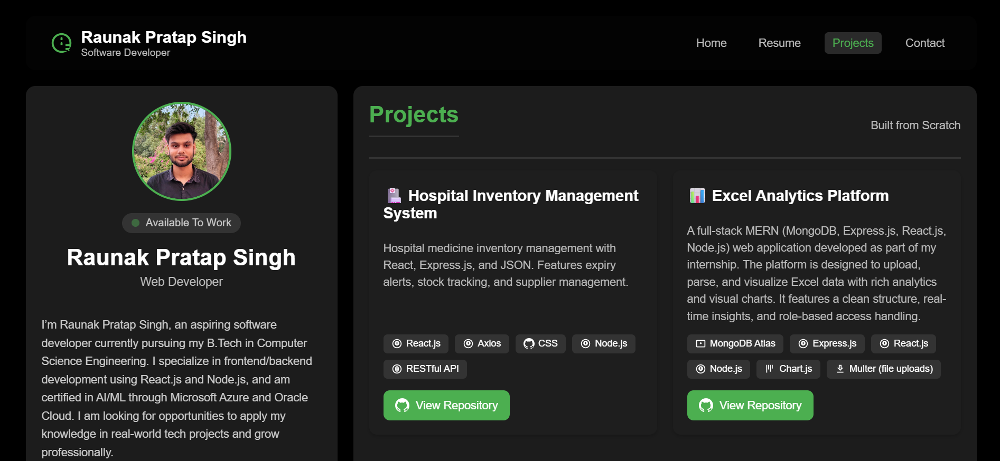
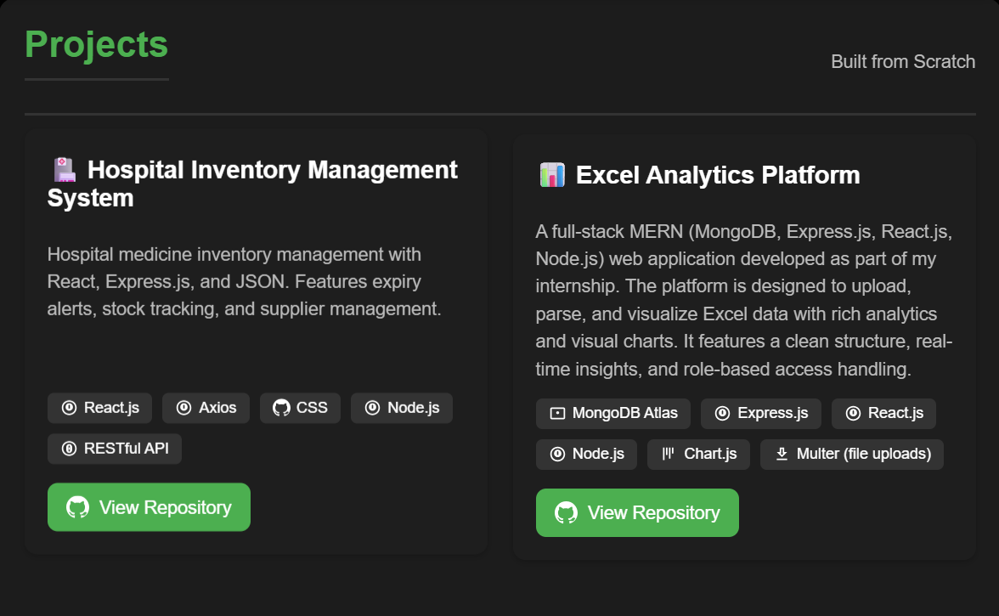

# 🚀 Raunak Pratap Singh – Developer Portfolio

Welcome to my personal portfolio website! This project showcases my professional journey, technical skills, and featured projects, all built with modern web technologies.

## 🧑‍💻 About Me

I’m **Raunak Pratap Singh**, an aspiring software developer currently pursuing my B.Tech in Computer Science Engineering. I am passionate about building full-stack web applications and solving real-world problems through code.

### 🎯 Interests
- Full-Stack Development (React.js, Node.js, Express.js)
- Cloud Platforms (Microsoft Azure, Oracle Cloud)
- AI/ML-Enabled Applications
- Real-world Tech Projects

## 🧱 Tech Stack

### 🌐 Website Frontend
- HTML5  
- CSS3  
- JavaScript  
- SVG Icons  

### 🧰 Project Technologies
- **Frontend:** React.js, Axios, Chart.js  
- **Backend:** Node.js, Express.js, RESTful API  
- **Database:** MongoDB Atlas (for Excel Analytics Platform)  
- **Utilities:** Multer (for file uploads)  
- **Tools:** Git, VS Code  

## 📌 Features

- 💼 **Featured Projects Section** – Project cards with detailed descriptions, tech stack icons & GitHub links  
- 🧠 **Skills Summary** – Showcases tools, languages & platforms  
- 📜 **Resume Access** – Downloadable resume link  
- 🔗 **Social Links** – LinkedIn, GitHub, Email & WhatsApp integration  
- 💡 **Responsive Design** – Optimized for all devices  
- 📍 **Integrated Google Map** – Location embedded with view-larger option  
- ✨ **Dynamic Header** – Shrinks on scroll for better UX  
- ⚙️ **Workflow & Strategy** – Outlines my dev process  
- 🎨 **Clean & Modern UI** – Dark-themed, dashboard-style layout  

## 🖼️ Screenshots

> *(Add your actual screenshots in the `assets/` folder and update image paths accordingly)*

- 💻 **Landing Page**  
  

- 📂 **Projects Showcase**  
  

- 📱 **Mobile View**  
  

## 📁 Folder Structure

```
Raunak_Portfolio/
├── index.html          # Main portfolio page
├── assets/             # Images, icons, logos
├── README.md           # This file
└── (other project files/folders as needed)
```

## 🚀 Getting Started

### ✅ Prerequisites
A modern web browser is all you need to view the site.

### 📦 Installation

Clone the repository:
```bash
git clone https://github.com/RaunakPS/Your-Portfolio-Website.git
```

Navigate to the project directory:
```bash
cd Your-Portfolio-Website
```

Open `index.html` in your browser to view the site.

## 💡 Usage

Use the sticky header to explore different sections.  
Click on **View Repository** under each project to visit its GitHub page.  
Use the **Mail Me** and **WhatsApp Me** buttons in the Contact section to get in touch.

## 🚫 License

This project is **not licensed** for public use, modification, or distribution.  
**All rights reserved © 2025 Raunak Pratap Singh**  
To use this work, contact me directly.

## 🙋‍♂️ Author

Built with ❤️ by **Raunak Pratap Singh**

### 🔗 Connect with me:
- [LinkedIn](https://www.linkedin.com/in/raunak-pratap-singh)
- [GitHub](https://github.com/RaunakPS)
- 📧 raunakpratapsingh4510@gmail.com
- 🌐 **Portfolio Website:** *(Add your live site URL here once deployed)*
